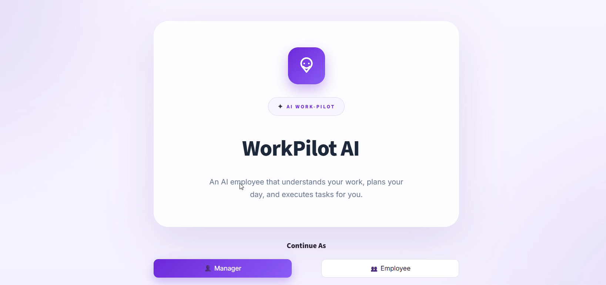
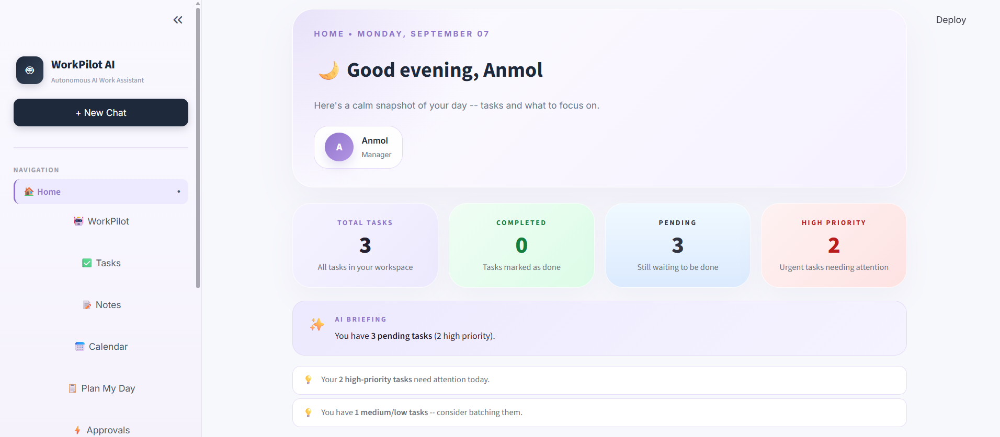
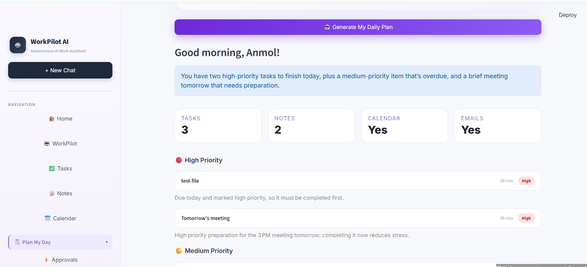
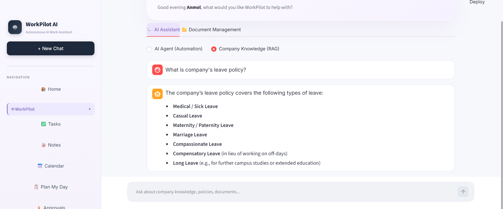
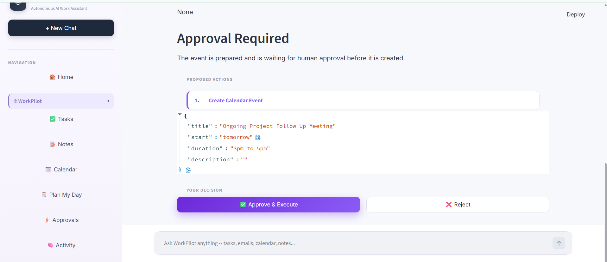
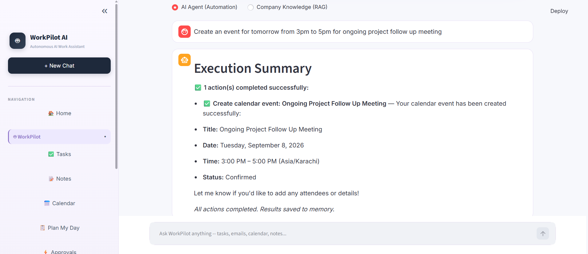
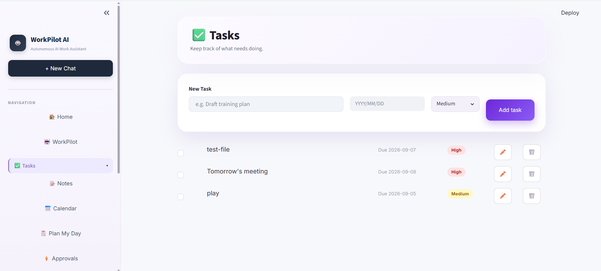
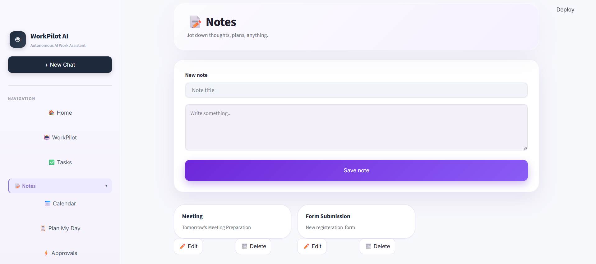

# 🚀 WorkPilot AI

> **An AI work assistant that understands your work, plans your day, and helps you get things done.**

**WorkPilot AI** is an agentic AI work-management platform that combines **multi-agent orchestration, RAG, task management, work context, planning, memory, and human-in-the-loop workflows** into a single workspace.

This repository contains the **Streamlit Demo version** of WorkPilot AI, designed to demonstrate the core product experience without requiring users to deploy the full backend infrastructure.

---

## 🌐 Live Demo

**Try WorkPilot AI:**

👉 **[Open the Streamlit Demo](YOUR_STREAMLIT_APP_URL)**

> Replace `YOUR_STREAMLIT_APP_URL` with your actual Streamlit Community Cloud URL after deployment.

### 🎥 Demo Video

👉 **[Watch the WorkPilot AI Demo](https://drive.google.com/file/d/1t4UnU3jqGWjHcP4VX6cAhy4iIjFtZq7c/view?usp=sharing)**

---

# 💡 What is WorkPilot AI?

Modern professionals manage work across multiple systems:

* Tasks
* Notes
* Email
* Calendar
* Slack
* Jira
* Company documents
* Meetings
* Research

Switching between these systems creates unnecessary context switching.

Traditional productivity applications organize information, while generic AI chatbots primarily answer questions.

**WorkPilot AI is designed to connect these capabilities.**

Instead of:

```text
User
  ↓
Ask Question
  ↓
AI
  ↓
Answer
```

WorkPilot follows an agentic workflow:

```text
User Request
     ↓
Understand Intent
     ↓
Load Work Context
     ↓
Plan
     ↓
Select Specialist
     ↓
Generate Result / Action
     ↓
Human Review
     ↓
Execute
     ↓
Verify
     ↓
Remember
```

The goal is to move from **AI that only answers** toward **AI that can understand, plan, and assist with work**.

---

# ✨ Demo Features

The public Streamlit demo focuses on the core WorkPilot experience.

## 🤖 AI Work Assistant

Interact with WorkPilot using natural language.

Example requests:

```text
Plan my workday.

What should I focus on today?

Show me my pending tasks.

Find information about the company policy.

Summarize my work context.

Help me organize today's priorities.
```

The assistant interprets the request and uses the appropriate WorkPilot capability.

---

## 📋 Task Management

WorkPilot provides an integrated task workspace.

Users can:

* Create tasks
* View tasks
* Track task status
* Set priorities
* Manage deadlines
* Review pending work
* Organize daily responsibilities

Tasks can also become part of the AI's work context.

Example:

```text
User:
Plan my day.

        ↓

WorkPilot reviews:

• Pending tasks
• Priorities
• Deadlines
• Work context

        ↓

AI-generated daily plan
```

---

## 📝 Notes

WorkPilot includes a workspace for creating and managing notes.

Notes can become part of the user's work context, allowing the AI to provide more relevant assistance.

Example:

```text
Meeting with the engineering team
- API integration pending
- Review deployment issue
- Follow up with backend team
```

---

## 📅 Daily Planning

WorkPilot can generate a structured daily plan based on available work information.

The planner can consider:

* Pending tasks
* Priorities
* Deadlines
* Existing work context

Example:

```text
User:
Plan my workday.

WorkPilot:

1. Complete high-priority deployment task
2. Review pending engineering issue
3. Follow up on outstanding task
4. Complete lower-priority documentation
```

---

# 📚 Enterprise Knowledge — RAG

WorkPilot includes a **Retrieval-Augmented Generation (RAG)** pipeline for answering questions from organizational documents.

### RAG Pipeline

```text
Documents
    ↓
Document Processing
    ↓
Text Chunking
    ↓
Embeddings
    ↓
ChromaDB
    ↓
Semantic Retrieval
    ↓
Relevant Context
    ↓
LLM
    ↓
Grounded Answer
```

Users can ask questions such as:

```text
What is the company's leave policy?

What does the employee handbook say about remote work?

Summarize the HR guidelines.
```

The system retrieves relevant document context before generating an answer.

### Technologies

* ChromaDB
* Sentence Transformers
* BGE embeddings
* LangChain
* Mistral / LLM-based generation

---

# 🔐 Role-Aware Knowledge Access

The full WorkPilot architecture supports role-aware enterprise knowledge retrieval.

For example:

```text
Manager
   │
   ├── General Company Documents
   ├── HR Information
   └── Management Resources


Employee
   │
   ├── General Company Documents
   └── Employee Resources
```

This allows retrieved knowledge to be filtered according to the user's role and permissions.

---

# 🧩 Agentic AI Architecture

WorkPilot uses a **Supervisor–Planner–Worker architecture**.

Instead of using a single agent for every task, requests can be routed to specialized capabilities.

### Core Components

| Component     | Responsibility                         |
| ------------- | -------------------------------------- |
| Supervisor    | Understands intent and routes requests |
| Planner       | Determines the required workflow       |
| RAG Agent     | Retrieves enterprise knowledge         |
| Daily Planner | Generates work plans                   |
| Work Manager  | Handles tasks and work context         |
| Responder     | Produces the final response            |
| Memory Layer  | Maintains persistent/contextual state  |

The architecture is designed to make the system easier to extend with additional agents and tools.

---

# 🏗️ System Architecture

### Streamlit Demo


---

# 🏢 Full WorkPilot Architecture

The original WorkPilot architecture can also connect the AI layer with external workplace systems.


---

# 🧑‍⚖️ Human-in-the-Loop

A core design principle of WorkPilot is:

> **AI-generated actions should be reviewable before consequential external execution.**

For actions that can create external side effects, the full architecture can pause for human approval.

```text
AI Decision
     ↓
Action Proposal
     ↓
Human Review
     │
 ┌───┴────┐
 ▼        ▼
Approve  Reject
 │        │
 ▼        ▼
Execute   Stop
 │
 ▼
Verify
```

Read-only requests can be handled without an approval step when no external side effect is involved.

---

# ⚡ Workplace Automation

The full WorkPilot architecture is designed to integrate with workplace services through **n8n workflows**.

```text
LangGraph
    │
    ▼
Structured Action
    │
    ▼
n8n Webhook
    │
    ▼
Workflow
    │
    ├── Email
    ├── Calendar
    ├── Slack
    └── Jira
```

This keeps external integrations separated from the core agent logic.

It also makes individual integrations easier to modify or replace.

---

# 🧠 Memory Architecture

WorkPilot can use multiple types of application state.

```text
                  WorkPilot State
                        │
          ┌─────────────┼─────────────┐
          ▼             ▼             ▼
      PostgreSQL    LangGraph      ChromaDB
      Structured    Checkpoints    Semantic
       Memory         / State      Knowledge
```

### PostgreSQL

The full application can use PostgreSQL for structured persistent information such as:

* User context
* Agent state
* Work information
* Action records

### LangGraph State

LangGraph state/checkpointing supports agent workflow execution and conversational context.

### ChromaDB

ChromaDB stores vectorized document information used for semantic retrieval.

---

# 🔎 Execution Verification

The full architecture is designed around:

> **Plan → Execute → Verify**

Instead of assuming that an external action succeeded, the system can process the returned execution result.

Example:

```text
Action:
send_email

Status:
Success

Details:
Email sent successfully
```

Or:

```text
Action:
create_calendar_event

Status:
Failed

Details:
Calendar service returned an error
```

The final response can then reflect the actual execution result.

---

# 📊 WorkPilot Dashboard

The dashboard acts as a centralized work command center.

It can provide access to:

* Today's tasks
* Upcoming tasks
* Recent notes
* Daily planning
* Work statistics
* AI assistance
* Recent activity

The demo version focuses on providing this experience directly through Streamlit.

---

# 🔄 Example Workflows

## 1. Daily Planning

```text
User
 │
 ▼
"Plan my workday."
 │
 ▼
Load work context
 │
 ▼
Review tasks
 │
 ▼
Prioritize work
 │
 ▼
Generate daily plan
```

---

## 2. Knowledge Question

```text
User
 │
 ▼
"What is the company's leave policy?"
 │
 ▼
RAG Agent
 │
 ▼
Retrieve relevant documents
 │
 ▼
Generate grounded response
```

---

## 3. Task Management

```text
User
 │
 ▼
"Create a task to review the deployment."
 │
 ▼
Work Manager
 │
 ▼
Create task
 │
 ▼
Update work context
```

---

## 4. External Action

In the full architecture:

```text
User Request
     ↓
Understand
     ↓
Plan
     ↓
Prepare Action
     ↓
Human Approval
     ↓
Execute
     ↓
Verify
     ↓
Return Result
```

---

# 🌐 Demo Mode vs Full Architecture

This repository contains the **Streamlit Demo configuration**.

### Demo Mode

The deployed demo is designed to run without requiring the complete production infrastructure.

```text
Streamlit
   │
   ▼
WorkPilot Demo Logic
   │
   ├── Tasks
   ├── Notes
   ├── Planning
   ├── Dashboard
   └── AI Features
```

Demo state can be maintained through Streamlit session state/local application state.

### Full Architecture

The complete WorkPilot architecture can additionally use:

```text
Streamlit
    ↓
FastAPI
    ↓
LangGraph
    ↓
PostgreSQL
    ↓
ChromaDB
    ↓
n8n
    ↓
Email / Calendar / Slack / Jira
```

This separation allows the public demo to remain lightweight while preserving the architecture for a more complete deployment.

---

# 🛠️ Technology Stack

| Category            | Technology            |
| ------------------- | --------------------- |
| Language            | Python                |
| Frontend            | Streamlit             |
| Agent Framework     | LangGraph             |
| LLM Framework       | LangChain             |
| LLMs                | Groq / Mistral        |
| Embeddings          | Sentence Transformers |
| Vector Database     | ChromaDB              |
| Backend             | FastAPI               |
| Database            | PostgreSQL            |
| Automation          | n8n                   |
| Document Processing | PyPDF                 |
| Containerization    | Docker                |
| Configuration       | python-dotenv         |

---

# 📁 Project Structure

```text
WorkPilot-AI/
│
├── agents/
│   └── daily_planner.py
│
├── rag/
│   ├── ingest.py
│   └── retrieve.py
│
├── _pages/
│   ├── _api.py
│   ├── activity_page.py
│   └── dashboard.py
│
├── auth.py
├── config.py
├── manager_panel.py
├── streamlit_app.py
├── work_manager.py
│
├── assets/
│   ├── welcome.png
│   ├── manager_panel.png
│   ├── plan_day.png
│   ├── Rag.png
│   ├── Event_Approval.png
│   ├── event_creation.png
│   ├── Tasks.png
│   └── Notes.png
│
├── requirements.txt
├── .gitignore
└── README.md
```

---

# 🚀 Run Locally

## 1. Clone the repository

```bash
git clone <YOUR_REPOSITORY_URL>

cd WorkPilot-AI-Deployment
```

## 2. Create a virtual environment

```bash
python -m venv fastenv
```

### Windows

```bash
fastenv\Scripts\activate
```

## 3. Install dependencies

```bash
pip install -r requirements.txt
```

## 4. Configure environment variables

Create a `.env` file if required by the selected configuration.

Example:

```env
DEMO_MODE=true
```

Additional API configuration may be required when running the full backend-enabled architecture.

> **Never commit API keys, passwords, database credentials, or `.env` files to GitHub.**

## 5. Start Streamlit

```bash
streamlit run streamlit_app.py
```

The application will normally be available at:

```text
http://localhost:8501
```

---

# ☁️ Streamlit Deployment

The demo is designed for deployment using **Streamlit Community Cloud**.

Typical deployment flow:

```text
GitHub Repository
       ↓
Select Branch
       ↓
Select streamlit_app.py
       ↓
Configure Secrets
       ↓
Deploy
       ↓
Public WorkPilot Demo
```

For the demo configuration, set the required environment variables/secrets through the Streamlit deployment settings rather than committing them to the repository.

---

# 🔐 Security Considerations

WorkPilot follows several design principles for safer AI workflows:

### Human Approval

Consequential actions can require explicit human approval.

### Controlled Tool Access

External services can be accessed through defined workflows rather than unrestricted agent access.

### Read / Write Separation

Read-only information retrieval is treated differently from operations that modify external systems.

### No Hardcoded Secrets

Credentials should be supplied through environment variables or deployment secrets.

### Execution Verification

External action results can be checked before reporting completion.

### Role-Aware Retrieval

Enterprise documents can be filtered according to user permissions.

---

# 🖼️ Screenshots

## Dashboard



## Manager Panel



## Daily Planning



## RAG / Document Q&A



## Human Approval



## Calendar Automation



## Task Management



## Notes



---

# 🎥 Demo

The demo demonstrates the WorkPilot experience, including:

* AI work assistance
* Dashboard
* Task management
* Notes
* Daily planning
* RAG-based document Q&A
* Human approval workflows
* Work context

👉 **[Watch the full demo video](https://drive.google.com/file/d/1t4UnU3jqGWjHcP4VX6cAhy4iIjFtZq7c/view?usp=sharing)**

---

# 🎯 Project Goals

WorkPilot AI demonstrates practical applications of modern Agentic AI:

* Large Language Models
* Multi-agent systems
* LangGraph orchestration
* Retrieval-Augmented Generation
* Semantic search
* Work-context awareness
* Task management
* Persistent state
* Human-in-the-loop workflows
* Tool integration
* Workflow automation
* Execution verification

The central idea is:

```text
Understand Work
      ↓
Plan Work
      ↓
Assist With Work
      ↓
Execute Safely
      ↓
Verify Results
      ↓
Remember Context
```

---

# 🔮 Future Improvements

Potential future enhancements include:

* More workplace integrations
* Advanced long-term memory
* Intelligent email prioritization
* Calendar optimization
* AI-generated daily briefings
* Advanced work analytics
* More granular RBAC
* Improved tool-failure recovery
* Agent evaluation
* Observability and tracing
* Automated workflow testing
* Production-grade authentication
* Enterprise SSO
* Scalable cloud infrastructure

---

# 📌 Project Status

**WorkPilot AI is a functional Agentic AI prototype with a deployable Streamlit demo.**

The public demo focuses on the core WorkPilot experience while the broader architecture demonstrates how the system can be extended with FastAPI, PostgreSQL, ChromaDB, n8n, and workplace integrations.

---

# 🧠 Core Concept

WorkPilot AI combines:

```text
Context
   +
Reasoning
   +
Planning
   +
Memory
   +
RAG
   +
Tools
   +
Human Oversight
   +
Verification
```

into a single AI-powered work-management experience.

---

# 👩‍💻 Built With

**Python · Streamlit · LangGraph · LangChain · Groq · Mistral · ChromaDB · Sentence Transformers · PostgreSQL · FastAPI · n8n · Docker**

---

## 👩‍💻 Author

**Rabia Haq**

AI Developer focused on:

**Generative AI · Agentic AI · RAG · Multi-Agent Systems · AI Automation**

---

> **WorkPilot AI is built around a simple idea:**
>
> **AI should understand your work, help you plan it, and assist you in getting it done — with humans remaining in control of consequential actions.**